# Level 1 to Level 5 Electrical Commissioning Framework

The commissioning matrix validates the operational resilience of critical data center infrastructure before final operational handover.

## Level 5 Integrated Systems Test (IST) Performance Timeline

This script validates full-scale facility blackout performance under a simulated $100\%$ nominal IT load baseline.

```mermaid
gantt
    title Integrated Systems Blackout Test (15-Second Critical Cycle)
    dateFormat  X
    axisFormat %ss
    section Main Breakers
    Utility MB-A/B Trip (Blackout Condition) :active, 0, 1
    section UPS Systems
    Battery Discharge Ride-Through Operations :crit, 0, 10
    Rectifier Soft Walk-In to Generator Load : 10, 15
    section Generators
    Emergency Standby Engine Auto-Crank (Device 27) : 1, 7
    ATS Transfer Mechanics Connect Emergency Bus : 7, 9
    section HVAC Cooling
    Chilled Water Backup Pumps Active : 10, 12
    CRAH Fans Arrays Staged Auto-Restart Sequence : 12, 15
```

