# Level 1 to Level 5 Electrical Commissioning Testing Framework

Commissioning is a systematic quality assurance process that validates the operational safety, electrical integrity, and system resilience of critical facility infrastructure before final operational handover.

This framework establishes the rigid testing matrices utilized to verify that the physical data center environment adheres completely to Tier III Concurrently Maintainable and Tier IV Fault-Tolerant thresholds.

---

## 1. The 5 Levels of Data Center Commissioning

The commissioning progression is structured across five sequential phases, driving infrastructure validation from factory assembly lines to full site integrated stress simulations.

| Commissioning Level | Framework Title                          | Primary Engineering Objectives & Execution Scope                                                                                                                  |
| :------------------ | :--------------------------------------- | :---------------------------------------------------------------------------------------------------------------------------------------------------------------- |
| **Level 1 (L1)**    | **Factory Acceptance Testing (FAT)**     | Witnessing equipment performance and factory build quality at vendor manufacturing facilities (e.g., generator load bank testing, UPS factory efficiency checks). |
| **Level 2 (L2)**    | **Component Static Inspection**          | Pre-energization physical audits, verifying cable torque specs, equipment anchor points, busbar alignments, and nameplate verification.                           |
| **Level 3 (L3)**    | **Pre-Functional Testing (PFT)**         | Component-level cold energization, breaker trip setting calibration, phase rotation verification, and individual startup sequences.                               |
| **Level 4 (L4)**    | **Functional Performance Testing (FPT)** | System-level operational validation under simulated thermal and electrical loads using temporary, heat-generating load banks.                                     |
| **Level 5 (L5)**    | **Integrated Systems Testing (IST)**     | Full-scale facility blackout, emergency generator auto-start, phase loss simulation, and catastrophic failure scenario testing under full design load.            |

---

## 2. Level 5 Integrated Systems Test (IST) Script: Full Facility Blackout

- **Test Objective:** Validate full facility blackout response, emergency generator auto-start under load, automatic ATS transfer, UPS battery ride-through integrity, mechanical cooling thermal ride-through capacity, and EPMS alarm telemetry stabilization.
- **Initial Baseline Conditions:**
  - White space loaded to $100\%$ nominal capacity ($2.0\text{ MW}$) using temporary resistive load banks.
  - UPS A and UPS B operating in normal online double-conversion mode.
  - Standby Generators Gen A and Gen B armed in AUTO backup mode.
  - Main Utility Input Breakers MB-A and MB-B closed.

### Automated Real-Time System Response Timeline

```mermaid
%%{init: {'gantt': {'axisFormat': '%S', 'topPadding': 50, 'leftPadding': 180, 'barHeight': 45, 'barGap': 16, 'sidePadding': 60, 'fontSize': 16, 'sectionFontSize': 18}}}%%
gantt
    title Integrated Systems Blackout Test (15-Second Critical Cycle)
    dateFormat  X
    axisFormat %ss

    section Main Breakers
    Utility MB-A/B Trip (Blackout Condition) :active, 0, 1

    section UPS Systems
    Battery Discharge Ride-Through Operations :crit, 0, 10
    Rectifier Soft Walk-In to Generator Load : 10, 15

    section Generators
    Emergency Standby Engine Auto-Crank (Device 27) : 1, 7
    ATS Transfer Mechanics Connect Emergency Bus : 7, 9

    section HVAC Cooling
    Chilled Water Backup Pumps Active : 10, 12
    CRAH Fans Arrays Staged Auto-Restart Sequence : 12, 15

```

### Logged Performance Telemetry Matrix

- **$[\text{T} + 00:00:00]$** — Main Utility Breakers MB-A & MB-B injected trip command. Primary utility service is completely lost.
- **$[\text{T} + 00:00:00]$** — **UPS Battery Ride-Through:** Static switches maintain load on inverter/battery power. Zero AC output voltage sag observed ($0\text{ ms}$ transfer time).
- **$[\text{T} + 00:00:00]$** — EPMS registers utility loss; PLC logic initiates alarm suppression masks to block secondary low-voltage downstream nuisance alerts.
- **$[\text{T} + 00:00:01.5]$** — IEEE Device 27 undervoltage relays on ATS units trigger emergency engine start signals to Gen-A and Gen-B.
- **$[\text{T} + 00:00:06.8]$** — Standby diesel generators stabilize at $1800\text{ RPM}$, $480\text{V}$ nominal, and $60\text{ Hz}$ frequency.
- **$[\text{T} + 00:00:08.2]$** — ATS-A and ATS-B switch mechanism positions, connecting emergency generator power to Main Switchboards.
- **$[\text{T} + 00:00:09.5]$** — UPS rectifiers complete controlled soft walk-in ($0\%$ to $100\%$ load over $5\text{ seconds}$), absorbing IT load from generators and ending battery discharge loops.
- **$[\text{T} + 00:00:10.0]$** — Primary chilled water circulation pumps resume operation via dedicated UPS-backed distribution feeds. Buffer tank temperature stays within limits ($12^\circ\text{C}$).
- **$[\text{T} + 00:00:14.2]$** — Chiller compressors and Computer Room Air Handler (CRAH) fan arrays execute staged auto-restart sequences, preventing white space thermal excursions.
- **$[\text{T} + 00:00:15.0]$** — EPMS dashboard validates stable system operations under generator backup power.

---

## 3. Pass/Fail Acceptance Criteria

1. **Zero power interruption** to critical load bank circuits ($100\%$ uptime maintained).
2. Maximum battery discharge duration must remain **$< 10\text{ seconds}$**.
3. Standby generators must sync, lock phase rotation, and stabilize **within 10 seconds of utility loss**.
4. Total white space ambient air temperature increase must stay **$< 1.5^\circ\text{C}$** during the complete thermal ride-through window.
