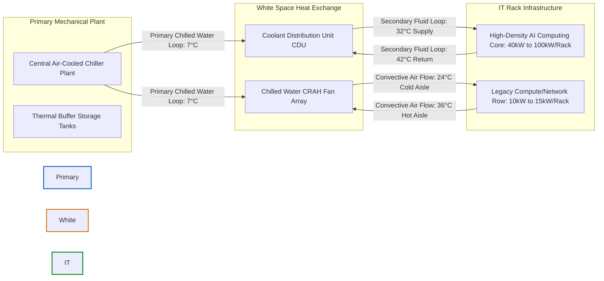

# Liquid & Air Cooling Thermal Integration Specifications

This engineering specification details the hybrid thermal management infrastructure designed to support high-density AI clusters (e.g., NVIDIA H100/B200 platforms) alongside legacy air-cooled IT workloads. The design optimizes heat rejection workflows via **Direct-to-Chip Liquid Cooling Distribution Products (CDP)** integrated with conventional **Computer Room Air Handlers (CRAH)**.

---

## 1. Thermodynamic Design Principles & Primary Heat Transfer Equation

To evaluate the heat rejection capacity required for high-density white space footprints, the mechanical infrastructure leverages the fundamental fluid thermodynamic mass flow equation:

$$Q = \dot{m} \cdot C_p \cdot \Delta T$$

Where:

- **$Q$** = Total Thermal Heat Dissipation Capacity (kW)
- **$\dot{m}$** = Fluid Mass Flow Rate ($\text{kg/s}$), which translates to volumetric flow rate via fluid density $\rho$
- **$C_p$** = Specific Heat Capacity of the working fluid ($\text{kJ/kg}\cdot^\circ\text{C}$)
- **$\Delta T$** = Thermal delta between the Supply and Return fluid temperatures ($T_{\text{return}} - T_{\text{supply}}$)

!!! info "Secondary Cooling Loop Fluid Metric"
For the secondary liquid loop utilizing a $25\%$ Propylene Glycol mixture at $32^\circ\text{C}$, the density $\rho$ is approximately $1022\text{ kg/m}^3$ and the specific heat capacity $C_p$ is $3.98\text{ kJ/kg}\cdot^\circ\text{C}$.

---

## 2. Hybrid Hybrid Cooling Loop Topology (Mermaid Schematic)

The facility operates a closed-loop system where high-density compute blocks are directly handled via Coolant Distribution Units (CDUs), while the surrounding convective ambient heat is captured by air-cooled chilled-water CRAH arrays.

---

## 3. Engineering Operating Parameters & Infrastructure Metrics

### Direct-to-Chip Coolant Distribution Units (CDUs)

- **Heat Rejection Capacity:** 300 kW nominal thermal transfer rating per CDU skid.
- **Secondary Loop Temperatures:** $32^\circ\text{C}$ Supply ($T_s$) / $42^\circ\text{C}$ Return ($T_r$), maintaining a strict $\Delta T$ of $10^\circ\text{C}$. This elevated temperature allows for extensive compressor-free economized free cooling.
- **Secondary Flow Rate:** Approximately $7.55\text{ Liters per Second (L/s)}$ per CDU package to fully satisfy the thermal load requirement under peak stress.

???+ warning "Thermal Risk Mitigation: Ashrae Class W4 Compliance"
Operating secondary liquid loops at $32^\circ\text{C}$ places the data center squarely in the **ASHRAE W4 thermal boundary class**. If the secondary flow rate falls below $92\%$ of nominal operational limits, the chip junction temperatures will exceed safe operating parameters within $4.2\text{ seconds}$, requiring an automated programmatic safety trip sequence.

### Computer Room Air Handlers (CRAH) & Hot Aisle Containment (HACC)

- **Airflow Topology:** Rigid **Hot Aisle Containment (HACC)** structure to physically isolate air mixing. Supply air is delivered at $24^\circ\text{C}$ into the cold aisle, and hot exhaust air returns to the CRAH intake at $36^\circ\text{C}$ ($\Delta T = 12^\circ\text{C}$).
- **CRAH Coil Metrics:** 4-row deep chilled water coils utilizing Electronic Commutated (EC) fan arrays running under variable-frequency speed controls linked straight to underfloor static pressure transducers.

---

## 4. Automation Thresholds & Telemetry Monitoring Matrix

The facility's building management system utilizes real-time tracking points to supervise cooling loop stability:

| Sensor ID Location | Monitored Parameter   | Normal Operational Threshold              | Warning State          | Critical Alarm Event                         |
| :----------------- | :-------------------- | :---------------------------------------- | :--------------------- | :------------------------------------------- |
| **CDU-SEC-TS-01**  | Secondary Supply Temp | $31.5^\circ\text{C} - 32.5^\circ\text{C}$ | $> 34.5^\circ\text{C}$ | $> 37.0^\circ\text{C}$ (Auto-Shunt Active)   |
| **CDU-SEC-FR-01**  | Secondary Flow Rate   | $7.2\text{ L/s} - 7.8\text{ L/s}$         | $< 6.8\text{ L/s}$     | $< 6.2\text{ L/s}$ (Standby CDU Start)       |
| **CRAH-HA-TEMP**   | Hot Aisle Containment | $35.0^\circ\text{C} - 37.0^\circ\text{C}$ | $> 39.5^\circ\text{C}$ | $> 42.0^\circ\text{C}$ (Max EC Fan Override) |
