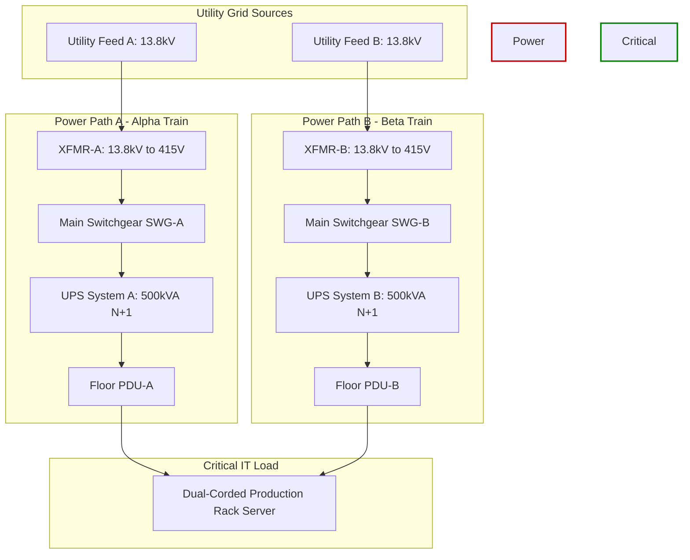

# 2N Redundant Single-Line Diagram Specifications

This specification delineates the electrical topology, physical switchgear separation, and automated interlocking logic for the **2N Redundant Power Distribution Architecture**. The design guarantees concurrent maintainability and fault isolation down to the component level without interrupting the critical IT load.

## 1. System Topology & Dual-Feed Architecture

The facility maintains two completely independent, mirrored power paths (**Side A** and **Side B**). There are no electrical cross-ties or common busses on the downstream output side of the Uninterruptible Power Supply (UPS) systems, eliminating all systemic single points of failure (SPOF).

## 2. Component System Specifications

### Main Medium-Voltage Switchgear (SWG-A & SWG-B)

- **Voltage Rating:** 13.8 kV Nominal, 3-Phase, 3-Wire, 60Hz.
- **Interrupting Rating:** 40kA Symmetrical Short Circuit current.
- **Interlocking Scheme:** Keyed-exchange system (Kirk Key) configured to prevent concurrent closing of the main utility breaker and the emergency generator breaker during un-synchronized manual transfers.

### Power Distribution Units (PDU-A & PDU-B)

- **Voltage Configuration:** 415V Line-to-Line (240V Line-to-Neutral), 3-Phase, 4-Wire + Ground.
- **Isolation Transformer:** K-Factor K-13 rated for harmonic mitigation arising from non-linear IT switch-mode power supplies.
- **Monitoring Matrix:** Real-time branch circuit monitoring capturing Phase Current (A), Neutral Current Vector (A), Voltage Balance (%), and active Power Factor tracking.

!!! note "Neutral Balancing Metric Link"
The line currents and unbalance return tracking models parsed by this PDU hardware map directly to the calculation engines exposed inside our **[3-Phase Analytics Framework](../automation_scripts/power_analytics_view.md)**.
